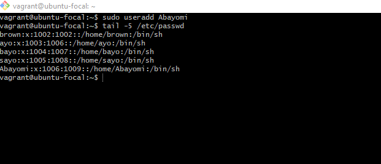
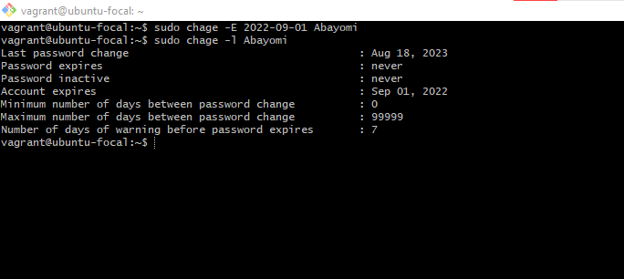
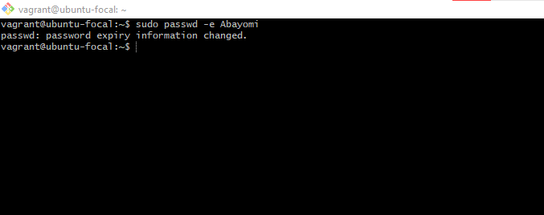
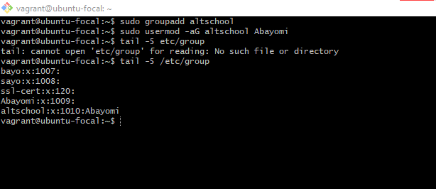
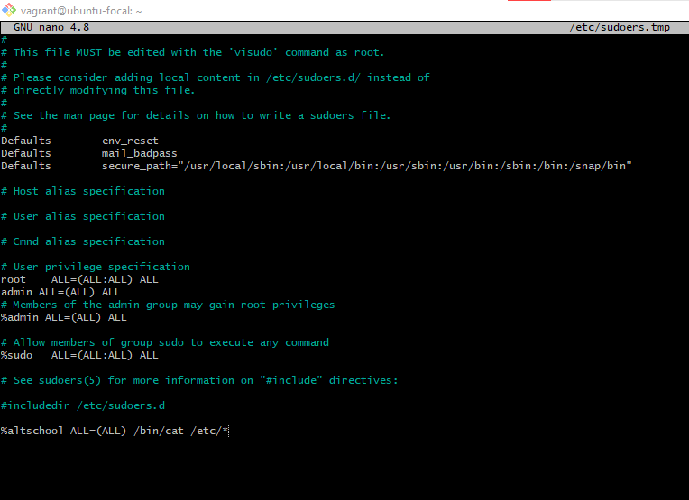
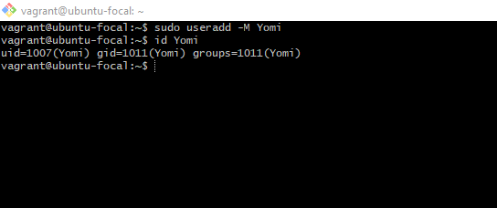

This is my linux assignment

This shows me creating the user **Abayomi**

This shows me setting an expiry date for the user **Abayomi**

This shows me promting **Abayomi** to change their password on login

This shows me adding **Abayomi** to the group **altschool**

This shows me adding code to allow **altschool** to run only cat command on /etc/

This shows me creating a user **Yomi** and making sure he does not have a home directory